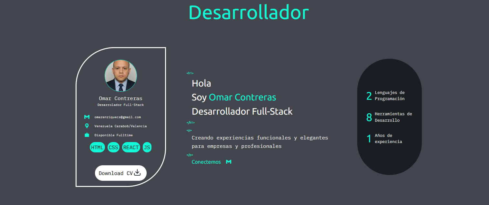
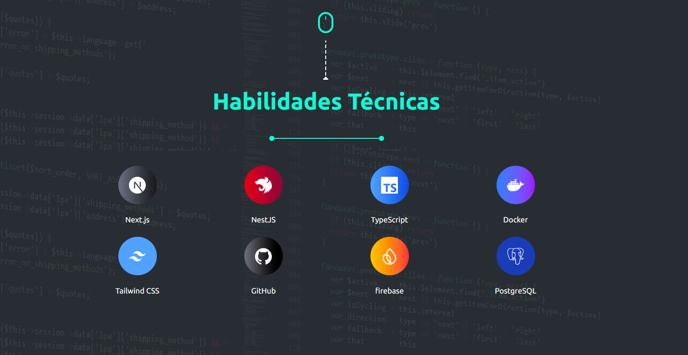

#  ¡Hola! Soy Omar Contreras

Soy un desarrollador web apasionado por crear aplicaciones eficientes, accesibles y centradas en el usuario. Actualmente estoy cursando el segundo módulo del bootcamp de **SoyHenry**, fortaleciendo mis habilidades con **JavaScript**, **React**, y tecnologías backend como **Node.js**. Me encanta resolver bugs, mejorar flujos de trabajo, y explorar soluciones creativas que eleven la experiencia del usuario.

---

##  Proyectos Destacados

###  [Página de Actividades Favoritas](https://github.com/pi-rym/PM1-omarenriquecsn)  
Formulario dinámico que permite ingresar actividades, verlas en tarjetas, y eliminarlas fácilmente con solo hacer clic.  
**Tecnologías:** HTML, CSS, JavaScript

###  [Gestor de Películas](https://github.com/pi-rym/PM2-omarenriquecsn)  
Consume una API para mostrar películas, permitir valoraciones, y agregar nuevas entradas a la base de datos.  
**Stack:** React, Bootstrap, Node.js, jQuery, HTML/CSS

###  [PujaYa Subastas](https://github.com/pujaya)  

Plataforma de subastas en tiempo real con autenticación, sistema de membresías, pagos con Stripe y panel administrativo.  
**Stack:** Next.js, NestJS, PostgreSQL, Firebase, Cloudinary, Stripe, Pusher, MapLibre, WebSockets, Render, Neon, Vercel

**Mi rol:** Desarrollo fullstack · Coordinación · Backend (auth, WebSocket) · Frontend (perfil, membresía, admin) · Deploy

#### 

 Capturas del Proyecto

- 
 Página de inicio  
  

## 
 Tecnologías y Herramientas
 

### Lenguajes

### Frameworks & Librerías

### Herramientas y Servicios

### Bases de datos

---

## 
 GitHub Stats

  

---

## 
 ¿Hablamos?

- ✉️ omarenriqueccs@gmail.com  
- 💼 [LinkedIn](https://www.linkedin.com/in/omarenriquecs)

